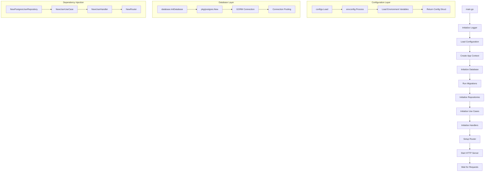
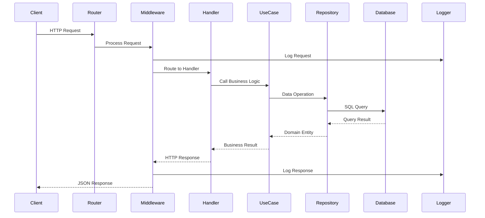
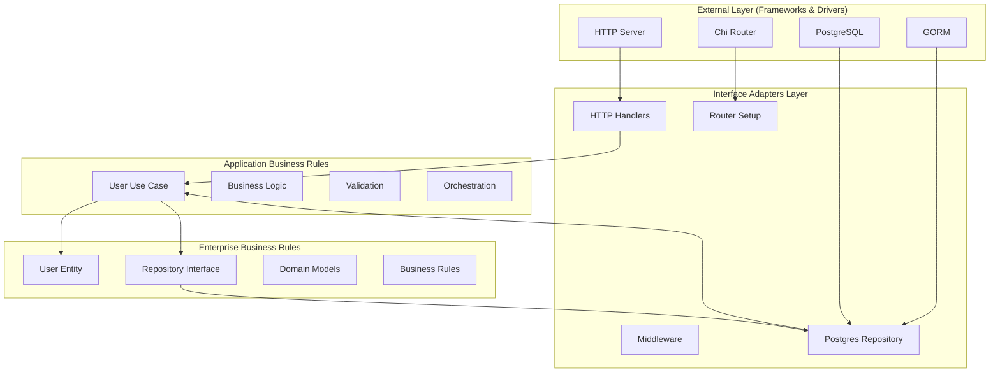
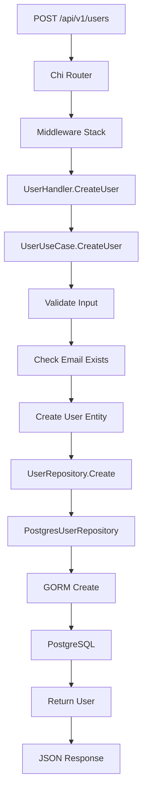
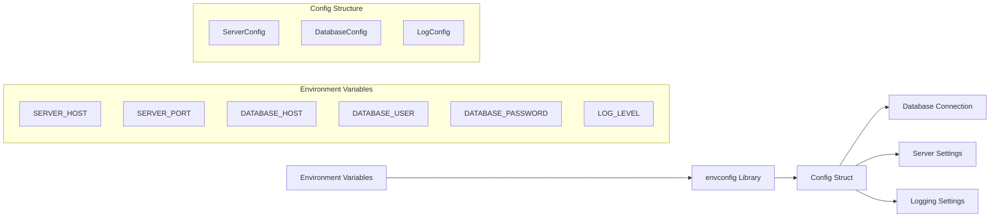
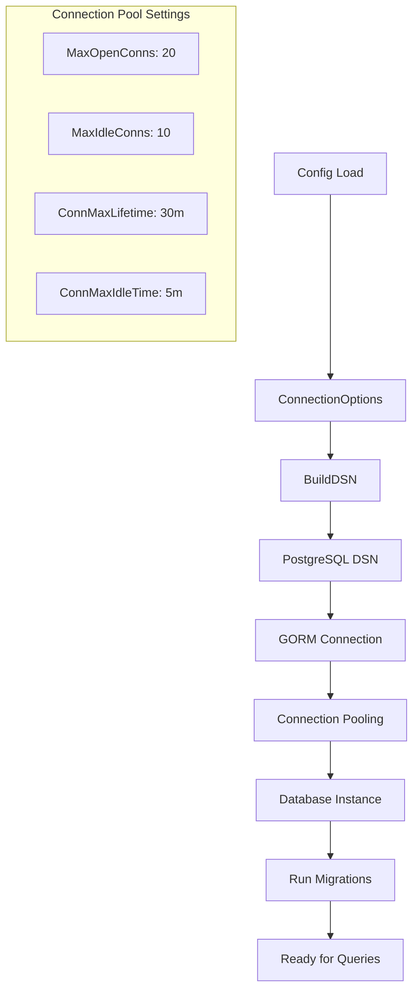
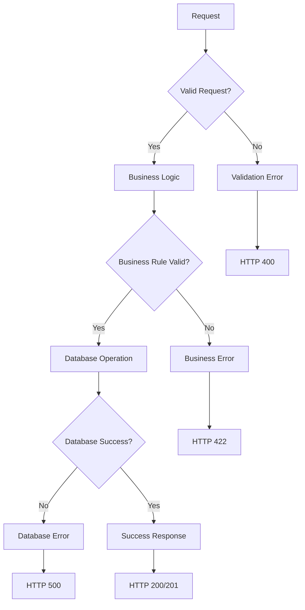
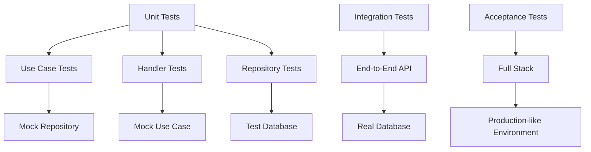
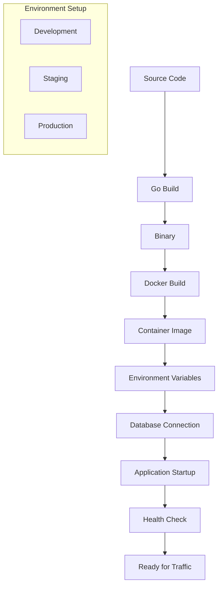

# Clean Architecture Flow Diagram

## Overview

This document illustrates the complete flow of the Clean Architecture implementation, from application startup to HTTP request handling and database operations.

## Application Startup Flow



## HTTP Request Flow



## Clean Architecture Layers



## Detailed Request Flow Example

### 1. Create User Request



### 2. Get User Request

```mermaid
graph TD
    A[GET /api/v1/users/{id}] --> B[Chi Router]
    B --> C[Middleware Stack]
    C --> D[UserHandler.GetUser]
    D --> E[UserUseCase.GetUserByID]
    E --> F[UserRepository.GetByID]
    F --> G[PostgresUserRepository]
    G --> H[GORM Query]
    H --> I[PostgreSQL]
    I --> J[Return User]
    J --> K[JSON Response]
```

## Configuration Flow



## Database Connection Flow



## Error Handling Flow



## Testing Flow



## Deployment Flow



## Key Principles Demonstrated

### 1. Dependency Inversion
- **Domain Layer** defines interfaces
- **Infrastructure Layer** implements interfaces
- **Use Case Layer** depends on abstractions, not concretions

### 2. Separation of Concerns
- **Entities**: Pure business objects
- **Use Cases**: Application business rules
- **Interfaces**: External communication
- **Infrastructure**: Technical implementation

### 3. Single Responsibility
- Each layer has one reason to change
- Handlers only handle HTTP
- Use Cases only handle business logic
- Repositories only handle data access

### 4. Open/Closed Principle
- Easy to add new use cases without modifying existing code
- Easy to add new repositories without changing business logic
- Easy to add new handlers without changing use cases

## Benefits of This Architecture

1. **Testability**: Each layer can be tested in isolation
2. **Maintainability**: Changes in one layer don't affect others
3. **Scalability**: Easy to add new features and modify existing ones
4. **Independence**: Business logic is independent of frameworks
5. **Flexibility**: Easy to swap implementations (e.g., database, HTTP framework)

## File Structure Mapping

```
cmd/server/main.go                    # Application Entry Point
├── internal/app/app.go              # Dependency Injection Container
├── internal/domain/                 # Enterprise Business Rules
│   ├── entities/user.go            # Core Business Objects
│   └── repositories/user_repository.go # Data Access Interfaces
├── internal/usecase/               # Application Business Rules
│   └── user_usecase.go            # Business Logic
├── internal/interfaces/http/       # Interface Adapters
│   ├── handlers/user_handlers.go   # HTTP Request Handling
│   ├── middleware/logging.go       # Cross-cutting Concerns
│   └── router/router.go            # Route Definitions
├── internal/infrastructure/        # Frameworks & Drivers
│   └── database/                   # Database Implementation
│       ├── postgres_user_repository.go # PostgreSQL Implementation
│       └── database.go             # Database Connection
├── pkg/                           # Reusable Packages
│   ├── postgres/                  # PostgreSQL Package
│   ├── logger/                    # Logging Package
│   └── utils/                     # Utility Functions
└── configs/                       # Configuration Management
    └── config.go                  # Environment Configuration
```

This architecture ensures that the business logic remains independent of external concerns while providing a clear and maintainable structure for the application. 
